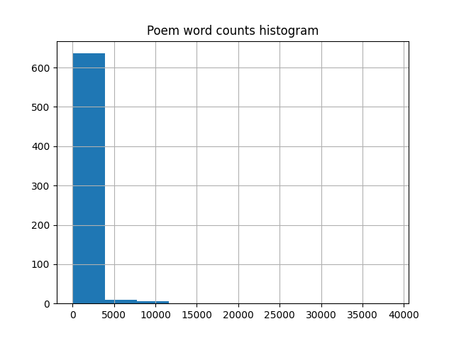
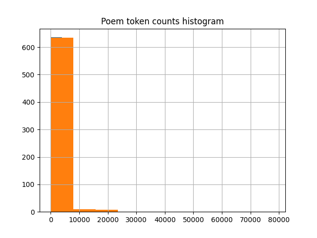
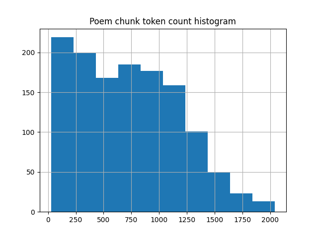

# Poetron

This repository contains the dataset and code for fine-tuning the [Slovak GPT-J-405M](https://huggingface.co/Milos/slovak-gpt-j-405M) model to generate poems in the style of the Slovak poet [Pavol Országh Hviezdoslav](https://en.wikipedia.org/wiki/Pavol_Orsz%C3%A1gh_Hviezdoslav).

## Dataset

The dataset is based on Hviezdoslav's works stored in the [Hviezdoslav repository](https://github.com/patrikflorek/hviezdoslav).

To reconstruct the dataset, clone the repository and install the required packages as follows:

```bash
git clone https://github.com/patrikflorek/poetron.git poetron
cd poetron
pip install -r requirements.txt
```

The dataset is created in three steps:

1. Analysis of downloaded Hviezdoslav's poetic works
2. Splitting long poems into smaller chunks
3. Creating the dataset for fine-tuning

### 1. Analysis of downloaded Hviezdoslav's poetic works

Dataset analysis is performed by script `full_length_poems_stats.py`.

#### Total counts

| Type  | Counts |
|:------|-------:|
| Word  | 464864 |
| Token | 933981 |

#### Top 5 poems by word and token counts

| Book                                    | Poem             | Word count | Token count |
|:----------------------------------------|:-----------------|-----------:|------------:|
| Gábor Vlkolinský                        | Gábor Vlkolinský |      38650 |       78324 |
| Ežo Vlkolinský                          | Ežo Vlkolinský   |      27061 |       53194 |
| Kratšia epika historická a spoločenská  | Alžbeta Thurzová |      12740 |       25180 |
| Agar                                    | Agar             |      11353 |       22531 |
| Kratšia epika zo života dedinského ľudu | Na salaši        |      10907 |       23019 |

#### Bottom 5 poems by word and token count

| Book        | Poem                                  | Word count | Token count |
|:------------|:--------------------------------------|-----------:|------------:|
| 1869. (II.) | Načo mi je mladosť, načo bez ľúbosti? |         14 |          23 |
| 1869. (I. ) | Dobre                                 |         14 |          31 |
| 1869. (II.) | Ožením sa, ožením!…                   |         19 |          39 |
| 1869. (II.) | Deti! Čo nesiete?                     |         20 |          54 |
| 1869. (II.) |  Nuž plač, keď sa ti plakať chce      |         22 |          33 |

#### Statistics

| Statistic          | Word count | Token count |
|:-------------------|-----------:|------------:|
| Average            |      710.8 |       428.1 |
| Standard Deviation |     2244.2 |      4545.9 |
| Median             |      200.0 |       390.0 |
| Mode               |       65.0 |       186.0 |
| Min                |       14.0 |        23.0 |
| 25%                |       96.0 |       186.0 |
| 50%                |      200.0 |       390.0 |
| 75%                |      543.5 |      1059.8 |
| Max                |   38650.0  |     78324.0 |

#### Histograms





#### Long poems

Long poems are defined as those exceeding 1024 tokens when tokenized using the Slovak GPT-J-405M model tokenizer. 

| Book                                    | Poem                                                            | Token count |
|:----------------------------------------|:----------------------------------------------------------------|------------:|
| 1869. (I.)                              | Dvadsiaty rok                                                   |        3739 |
| 1869. (II.)                             | Ospievané je už, už všetko                                      |        1043 |
| 1916 - 1920                             | V jesennú polnoc                                                |        3552 |
| 1916 - 1920                             | Hymna                                                           |        1911 |
| Agar                                    | Agar                                                            |       22531 |
| Azyl                                    | Azyl                                                            |        1830 |
| Básne príležitostné                     | Púť živeny                                                      |        4449 |
| Básne príležitostné                     | 24. novembra 1910                                               |        1296 |
| Básne príležitostné                     | Michal Miloslav Hodža                                           |        2076 |
| Básne príležitostné                     | Na storočnú pamiatku                                            |        1839 |
| Básne príležitostné                     | Kantáta                                                         |        1945 |
| Básne príležitostné                     | Prívet                                                          |        4231 |
| Básne príležitostné                     | Pri hrobe Pavla Mudroňa                                         |        1333 |
| Básne príležitostné                     | Nad knihou Vrchlického                                          |        1414 |
| Básne príležitostné                     | Pri hrobe Svetozára Hurbana-Vajanského                          |        1108 |
| Básne príležitostné                     | Storočná pamiatka narodenia Andreja Radlinského v Dolnom Kubíne |        1131 |
| Básne príležitostné                     | Mládeži československej                                         |        2443 |
| Básne príležitostné                     | Národe drahý                                                    |        1332 |
| Básne príležitostné                     | Poslanie verejnosti československej                             |        1478 |
| Básne príležitostné                     | K znovutovoreniu Matice slovenskej                              |        2810 |
| Básne príležitostné                     | Predslov k otvoreniu Gymnázia v Dolnom Kubíne                   |        2317 |
| Básne príležitostné                     | Mladé Slovensko                                                 |        1448 |
| Básne príležitostné                     | Na pamäť                                                        |        2763 |
| Básnické prviesenky Jozefa Zbranského   | Ja som Slovák                                                   |        1093 |
| Básnické prviesenky Jozefa Zbranského   | Na Všechsvätých                                                 |        1254 |
| Básnické prviesenky Jozefa Zbranského   | Kostol                                                          |        1304 |
| Básnické prviesenky Jozefa Zbranského   | K tej slovenskej mládeži                                        |        1061 |
| Básnické prviesenky Jozefa Zbranského   | Roztomil                                                        |        2827 |
| Bútora a Čútora                         | Bútora a Čútora                                                 |        9378 |
| Dozvuky I                               | Na skalisku stred hlbokých lesov                                |        1683 |
| Dozvuky I                               | Nové zvuky počujem                                              |        1486 |
| Dozvuky I                               | Maliarka prišla k nám z ďalekých končín                         |        1556 |
| Dozvuky I                               | Spí matka zem                                                   |        1789 |
| Dozvuky II                              | Chyžnianskemu                                                   |        3545 |
| Dozvuky II                              | Zawilińskému                                                    |        1472 |
| Dozvuky II                              | Je Obrátenie Pavla                                              |        5297 |
| Dozvuky II                              | Mňa vzal si národ za predmet                                    |        1178 |
| Dozvuky II                              | Hluk odšumel - v dym blýskavica hravá...                        |        1250 |
| Dozvuky II                              | Nie zvláštnosť? mne svet vyhýba                                 |        1234 |
| Dozvuky II                              | Prejdite trebárs celú prírodu                                   |        1290 |
| Dozvuky II                              | Dve obce schodím zavše prechádzkou                              |        2209 |
| Dozvuky III                             | Rád oblaky v ich ceste odprevádzam                              |        2428 |
| Dozvuky III                             | O modrom vtáku vám včuľ zaspievam                               |        2293 |
| Ežo Vlkolinský                          | Ežo Vlkolinský                                                  |       53194 |
| Gábor Vlkolinský                        | Gábor Vlkolinský                                                |       78324 |
| Hájnikova žena                          | I                                                               |        4092 |
| Hájnikova žena                          | II                                                              |        6548 |
| Hájnikova žena                          | III                                                             |        5868 |
| Hájnikova žena                          | IV                                                              |        2875 |
| Hájnikova žena                          | V                                                               |        4277 |
| Hájnikova žena                          | VII                                                             |       16193 |
| Hájnikova žena                          | VIII                                                            |        1562 |
| Hájnikova žena                          | Maliniarky                                                      |        6402 |
| Hájnikova žena                          | IX                                                              |       11149 |
| Hájnikova žena                          | X                                                               |        3717 |
| Hájnikova žena                          | XI                                                              |        3881 |
| Hájnikova žena                          | XIII                                                            |        1960 |
| Hájnikova žena                          | XV                                                              |        1239 |
| Kain                                    | Kain                                                            |       16136 |
| Kratšia epika historická a spoločenská  | Pribina                                                         |        1863 |
| Kratšia epika historická a spoločenská  | Rastislav                                                       |        1335 |
| Kratšia epika historická a spoločenská  | Ľútosť Svätopluka                                               |        7879 |
| Kratšia epika historická a spoločenská  | Bratranci                                                       |        1791 |
| Kratšia epika historická a spoločenská  | Žofia Bosňáková                                                 |        6618 |
| Kratšia epika historická a spoločenská  | Alžbeta Thurzová                                                |       25180 |
| Kratšia epika historická a spoločenská  | Imro Tekeľ                                                      |        7324 |
| Kratšia epika historická a spoločenská  | Pani z Mahoču                                                   |        1429 |
| Kratšia epika historická a spoločenská  | Jánošíkova stupaj                                               |        7063 |
| Kratšia epika historická a spoločenská  | Pomsta mŕtvych                                                  |        1897 |
| Kratšia epika historická a spoločenská  | Polyxena Párnická                                               |        1990 |
| Kratšia epika historická a spoločenská  | Pán Boldko                                                      |        8684 |
| Kratšia epika historická a spoločenská  | Krivoprísažník                                                  |        2006 |
| Kratšia epika historická a spoločenská  | Jedlica                                                         |        1920 |
| Kratšia epika historická a spoločenská  | Susedia                                                         |        1877 |
| Kratšia epika historická a spoločenská  | Páni majstri                                                    |        2442 |
| Kratšia epika historická a spoločenská  | Dva vŕšky                                                       |        1265 |
| Kratšia epika historická a spoločenská  | Proťajšky                                                       |        1907 |
| Kratšia epika historická a spoločenská  | Dve rieky                                                       |        1368 |
| Kratšia epika zo života dedinského ľudu | Anča                                                            |        2645 |
| Kratšia epika zo života dedinského ľudu | Veštba kukučky                                                  |        1959 |
| Kratšia epika zo života dedinského ľudu | Zuzanka Hraškovie                                               |        1049 |
| Kratšia epika zo života dedinského ľudu | Margita                                                         |        2373 |
| Kratšia epika zo života dedinského ľudu | Studnica                                                        |        5010 |
| Kratšia epika zo života dedinského ľudu | Smelá Katka                                                     |       11719 |
| Kratšia epika zo života dedinského ľudu | Topeľci                                                         |       10936 |
| Kratšia epika zo života dedinského ľudu | Na Luciu                                                        |       22557 |
| Kratšia epika zo života dedinského ľudu | Mladá vdova                                                     |       19085 |
| Kratšia epika zo života dedinského ľudu | Matúš Stolár                                                    |        2074 |
| Kratšia epika zo života dedinského ľudu | Zuzka Majerovie                                                 |        1317 |
| Kratšia epika zo života dedinského ľudu | Deľba dedičstva                                                 |        1858 |
| Kratšia epika zo života dedinského ľudu | Jano Garazda                                                    |        2866 |
| Kratšia epika zo života dedinského ľudu | Šumihorka                                                       |        1821 |
| Kratšia epika zo života dedinského ľudu | Vrtohlávka                                                      |        4256 |
| Kratšia epika zo života dedinského ľudu | Potecha                                                         |        2248 |
| Kratšia epika zo života dedinského ľudu | Na výhone                                                       |        1168 |
| Kratšia epika zo života dedinského ľudu | Miško Káčer                                                     |        4505 |
| Kratšia epika zo života dedinského ľudu | Mlatba                                                          |        1501 |
| Kratšia epika zo života dedinského ľudu | Oráč a kosec                                                    |        4106 |
| Kratšia epika zo života dedinského ľudu | Na salaši                                                       |       23019 |
| Kratšia epika zo života dedinského ľudu | Dve návštevy                                                    |       13555 |
| Krvavé sonety                           | Krvavé sonety                                                   |        5594 |
| Letorosty I                             | Ach, nevoľa!                                                    |        2126 |
| Letorosty II                            | 26. novembra 1886                                               |        3404 |
| Letorosty II                            | Čierny rok                                                      |        4023 |
| Letorosty III                           | Matka zem                                                       |        2584 |
| Letorosty III                           | Ó, prečo som nie víchrom!?                                      |        1531 |
| Letorosty III                           | Elégie pôstne                                                   |        2033 |
| Letorosty III                           | K vám, urodzeným, veľkomožným                                   |        2539 |
| Letorosty III                           | Ruch v poli                                                     |        1782 |
| Na obnôcke                              | Na obnôcke                                                      |       15287 |
| Poludienok                              | Poludienok                                                      |        5820 |
| Prechádzky jarom                        | Breh, vŕšok, bralo, hoľa, Tatier štít                           |        1476 |
| Prechádzky letom                        | Nie: teba, slnko slávne, neovládze                              |        4615 |
| Prechádzky letom                        | Za jara zavše vídať v dúbrave                                   |        2195 |
| Prechádzky letom                        | Cveng kosí... až vše v slnku zblýska sa!                        |        2304 |
| Prechádzky letom                        | Zvážajú z poľa... radosť, veselie                               |        3126 |
| Prvý záprah                             | Prvý záprah                                                     |        5670 |
| Ráchel                                  | I                                                               |        3161 |
| Ráchel                                  | II                                                              |        4514 |
| Ráchel                                  | III                                                             |        3227 |
| Ráchel                                  | IV                                                              |        1443 |
| Ráchel                                  | V                                                               |        1068 |
| Stesky 1                                | Ó, po tak dlhej trápnej suchote                                 |        1075 |
| Stesky 1                                | Nedávno, jak tak v izbe sedím si                                |        3840 |
| Stesky 1                                | Čo tak tie piesne naše nábožné                                  |        1119 |
| Stesky 1                                | Už za detstva, snáď čo som prvý raz                             |        1722 |
| Stesky 1                                | Po poliach, stráňach chodí Jaro                                 |        3112 |
| Stesky 1                                | Ó, smutno duši                                                  |        1085 |
| Stesky 1                                | Som na vrchole veku ľudského                                    |        4282 |
| Stesky 2                                | Ja s plnou dušou vrátil som sa                                  |        3510 |
| Stesky 2                                | Čítal iste ako malý žiačik                                      |        1332 |
| Stesky 2                                | Nedávno starec chodil u mňa                                     |        1470 |
| Stesky 2                                | Slnce, životodarca!                                             |        1703 |
| Stesky 2                                | Že zvuky mojej citnej lýry                                      |        1195 |
| Stesky 2                                | V tom, čo som bol zabral po rokoch                              |        2597 |
| Stesky 2                                | Zaduli vetry                                                    |        1508 |
| Stesky 3                                | Jak príroda len začne klíčiť trávky                             |        1056 |
| Stesky 3                                | Čo pechoríte sa?                                                |        2196 |
| Stesky 3                                | Som decko zas...                                                |        3383 |
| Stesky 4                                | Ó, práci všetka česť, česť práci všetka!                        |        1103 |
| Stesky 4                                | Smrť v susedstve!                                               |        2251 |
| Stesky 4                                | Tak sám a sám!...                                               |        1407 |
| Stesky 4                                | Zájď, slnko, zájď už!                                           |        4270 |
| Stesky 4                                | Koľkorázkoľvek už čo zrelý muž                                  |        2936 |
| Stesky 4                                | Na bujnej si lúke ležím horeznačky                              |        1825 |
| Stesky 4                                | Návšteva                                                        |        6100 |
| Stesky 4                                | Kukučínovi                                                      |        2640 |
| Stesky 4                                | Za oných časov snivej mladosti                                  |        4713 |
| Stesky 4                                | Slovenský Prometej                                              |        6974 |
| Stesky 4                                | U nás toľko rezkej sily                                         |        5797 |
| Stesky 4                                | Ďakujte na kolenách bohu!                                       |        1693 |
| Stesky 4                                | Epilóg                                                          |        1921 |
| V pamäť                                 | Roľník                                                          |        3248 |
| V pamäť                                 | Priadka                                                         |        2437 |
| V pamäť                                 | Nový život                                                      |        1645 |
| V žatvu                                 | V žatvu                                                         |       16148 |
| Večera                                  | Večera                                                          |       10773 |
| Z básní, venovaných A. Medzihradskému   | Jarný ples                                                      |        1199 |
| Z básní, venovaných A. Medzihradskému   | Stará lipa                                                      |        1238 |
| Z básní, venovaných A. Medzihradskému   | Z našich dva zvyky                                              |        1216 |
| Žalmy a hymny                           | Žalm na tisícročnú pamiatku vierozvestcov sv. Cyrila a Metodeja |        2665 |
| Žalmy a hymny                           | Žalm ku závierke roku                                           |        2248 |
| Žalmy a hymny                           | Žalm žaloby                                                     |        1352 |
| Žalmy a hymny                           | De Profundis                                                    |        1905 |
| Žalmy a hymny                           | Hviezdnaté nebo                                                 |        1296 |
| Žalmy a hymny                           | Blízko si, Pane!                                                |        3093 |
| Žalmy a hymny                           | Žalm života                                                     |        2016 |

### 2. Splitting long poems into smaller chunks

Long poems are split into smaller chunks with target size of approximately 1000 tokens per chunk. The script `chunk_poems.py` is used for this purpose.

### 3. Creating the dataset for fine-tuning

The dataset for fine-tuning is created by script `create_dataset.py`. First some statistical analysis is performed in the similar way as for full length poems. For the analysis and fine-tuning the sequences are prepended with the sequence "[POH] " (with a trailing space!) to initiate the generation of poems in style similar to the one of Pavol Országh Hviezdoslav.

**Total token count**: 938447

#### Top 5 poem chunks by token count

| Book             | Poem chunk                           | Token count |
|:-----------------|:-------------------------------------|------------:|
| Ežo Vlkolinský   | Ežo Vlkolinský_33                    |        2044 |
| Stesky 2         | V tom, čo som bol zabral po rokoch_0 |        2041 |
| Gábor Vlkolinský | Gábor Vlkolinský_0                   |        1986 |
| Agar             | Agar_7                               |        1935 |
| Gábor Vlkolinský | Gábor Vlkolinský_14                  |        1923 |

#### Bottom 5 poem chunks by token count

| Book        | Poem chunk                               | Token count |
|:------------|:-----------------------------------------|------------:|
| 1869. (II.) | Načo mi je mladosť, načo bez ľúbosti?_0  |          26 |
| 1869. (I. ) | Dobre_0                                  |          35 |
| 1869. (II.) | Nuž plač, keď sa ti plakať chce_0        |          37 |
| 1869. (I. ) | Jarmo je_0                               |          41 |
| 1869. (II.) | Čo sa to tak veľmi nebom tým červenie?_0 |          42 |


#### Statistics

| Statistic          | Token count |
|:-------------------|------------:|
| Average            |       725.8 |
| Standard Deviation |       448.7 |
| Median             |       679.0 |
| Mode               |       190.0 |
| Min                |        26.0 |
| 25%                |       340.0 |
| 50%                |       679.0 |
| 75%                |      1055.8 |
| Max                |      2044.0 |


#### Histogram




#### Train-test split

The dataset is split into training and testing sets with ratio 80:20, coresponding to 1034 training samples and 259 testing samples. The training and testing sets are then saved into `poh_dataset.zip` archive.
